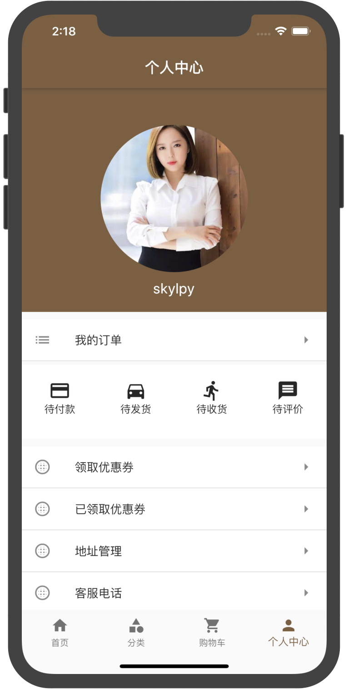

# flutter_shop_app
此项目分为前端和后端项目，前端是flutter+dart写的兼容iOS和Android的app，后端使用node.js 写的商城模拟数据,其中flutter_girlshop项目是前端项目，只需要装好flutter和dart所需要的环境就可以运行，girl_shop_server 项目为服务端，需要装好node环境就可以运行 

# 依赖的框架
  cupertino_icons: ^0.1.2 
  dio: ^2.0.7 
  flutter_swiper: ^1.1.4 
  flutter_screenutil: ^0.5.1 
  url_launcher: ^5.0.1 
  flutter_easyrefresh: ^1.2.7 
  provide: ^1.0.2 
  fluttertoast: ^3.0.1 
  fluro: ^1.4.0 
  flutter_html: ^0.9.6 
  sqflite: ^1.1.0 
  shared_preferences: ^0.5.1 
  //  provider: ^3.1.0

